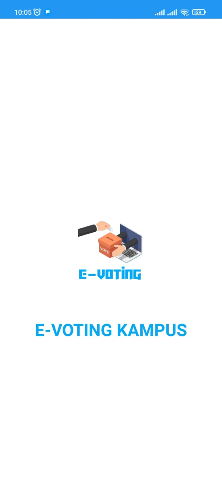
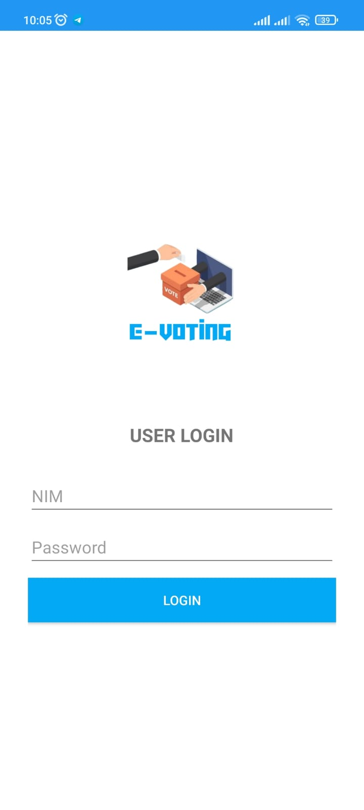
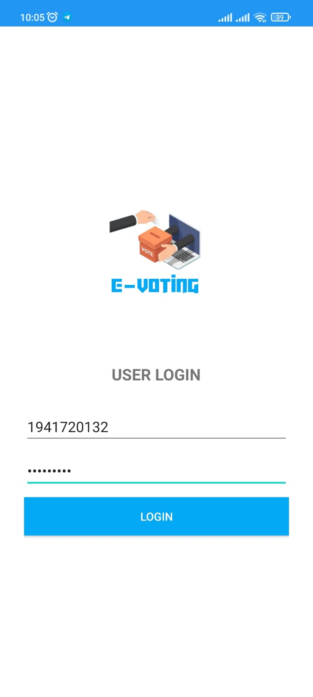
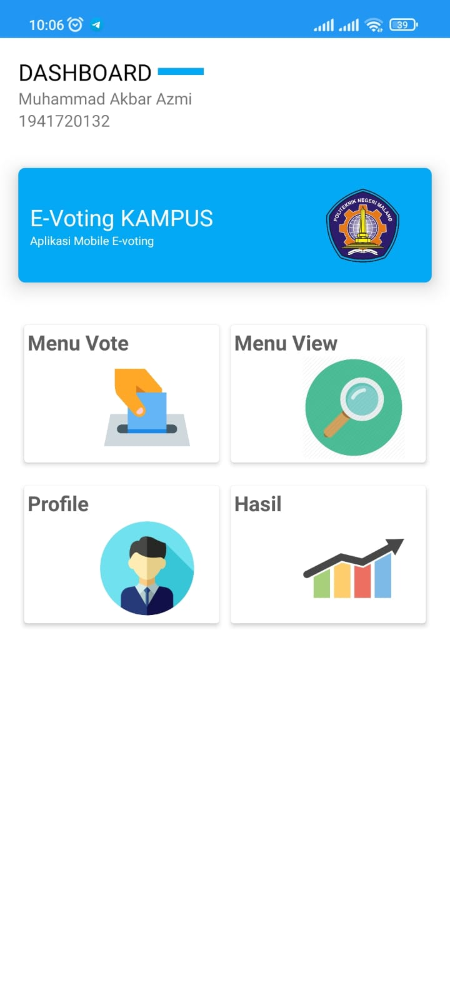
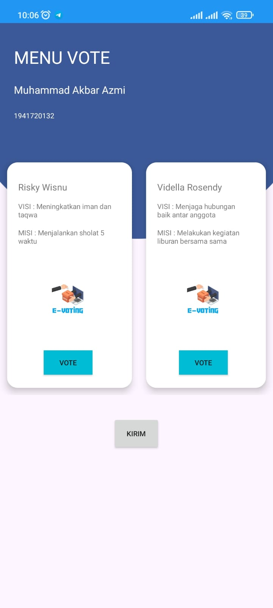
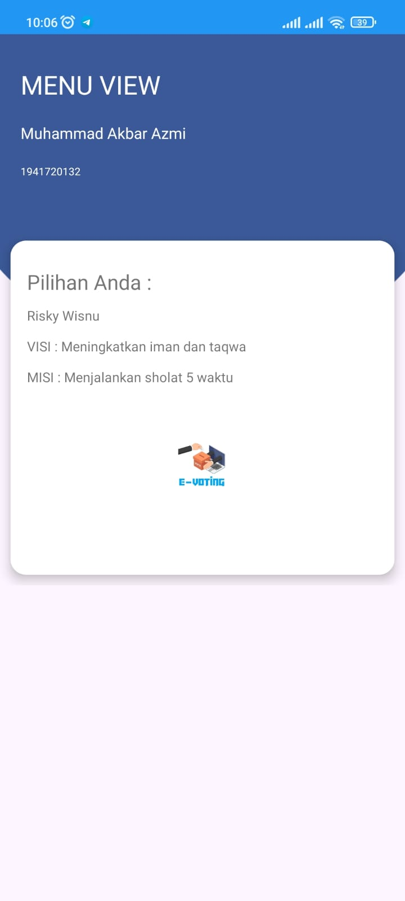
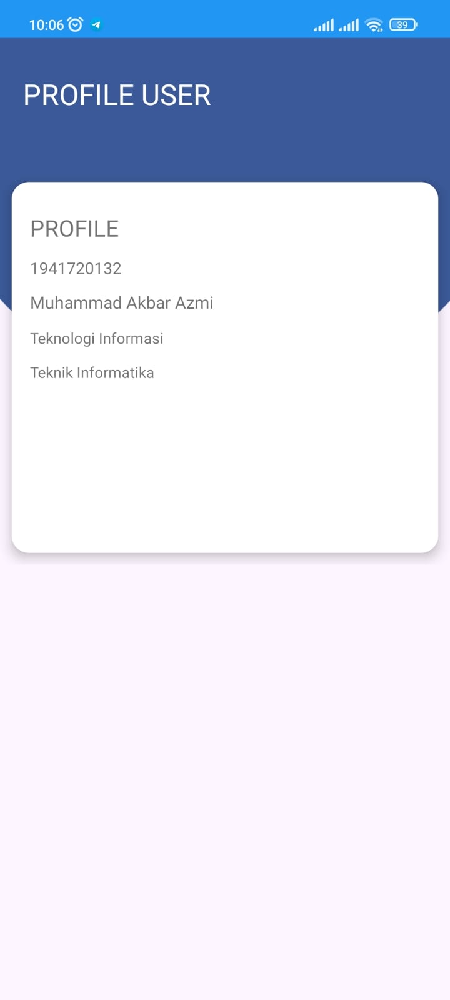
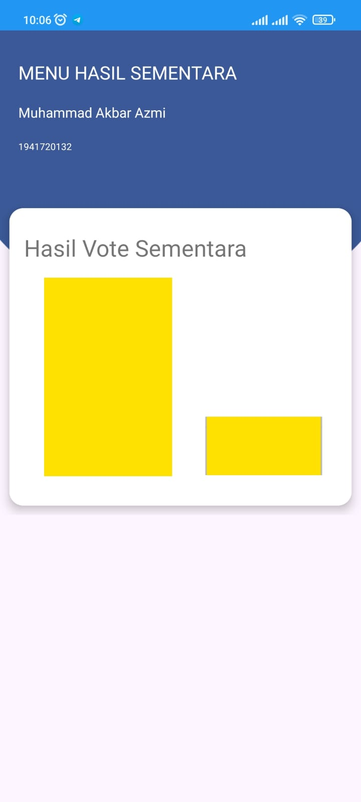

# Laporan UTS KELOMPOK ExTim
Yang beranggotakan  
1. Mohammad Videla Rosendy  (1941720123)
2. Muhammad Akbar Azmi      (1941720074)
3. Fayyadh Al Baity         (1941720132)

Berikut ini adalah bukti bahawa Sistem UI kami yang berjudul E-Voting Kampus telah berjalan.

1. Yang pertama ada tampilan awal dari sistem UI yang telah kami buat yaitu "E-VOTING KAMPUS". 

    

2. Selanjutnya mengarah ke sistem user login.

    

3. Pada sistem user login ini dapat mengisi data meliputi NIM dan Password.

    

4. Selanjutnya tampilan Dashboard dimana pada tampilan Dashboard terdapat 4 menu utama. 

    Empat menu utama tersebut meliputi :
    1. Menu Vote 
    2. Menu View
    3. Profile
    4. Hasil

    

5. Pada Menu Vote terdapat dua pilihan dalam menentukan pilihan vote sesuai keinginan user, selanjutnya klick kirim.

    

6. Pada Menu View menampilkan hasil vote yang telah dipilih oleh user.

    

7. Selanjutnya adalah tampilan profile User. 

    

8. Terakhir ada tampilan Menu Hasil Vote Sementara.

    

